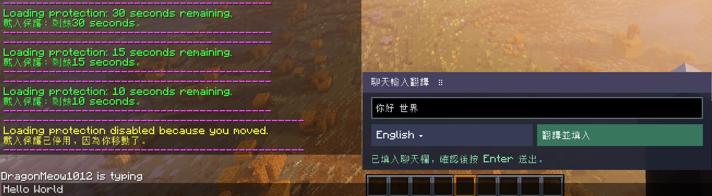
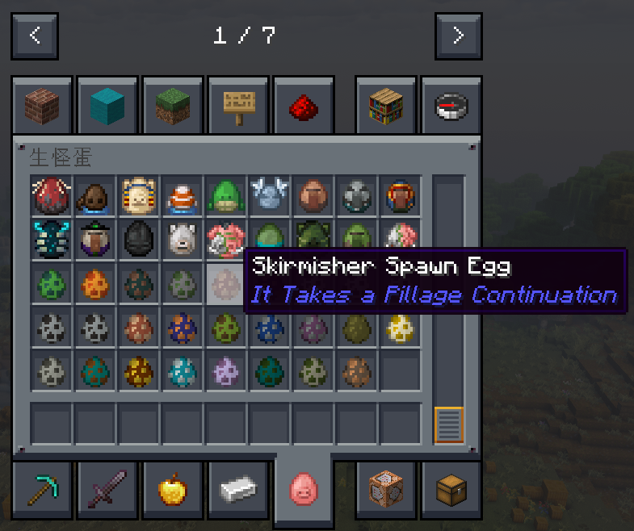
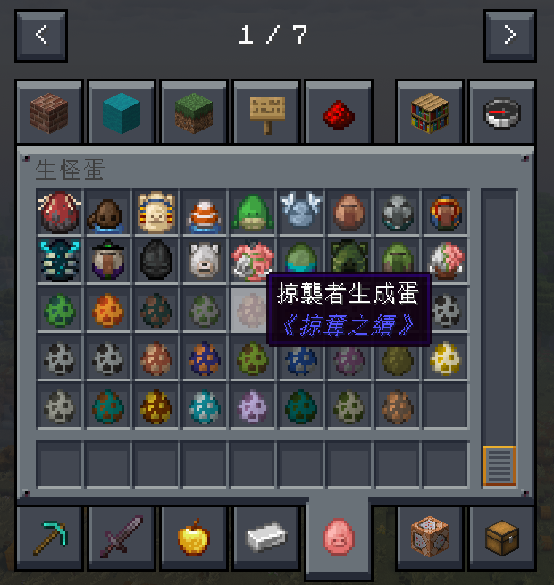
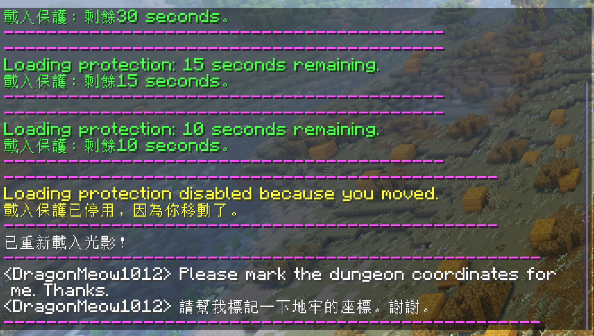
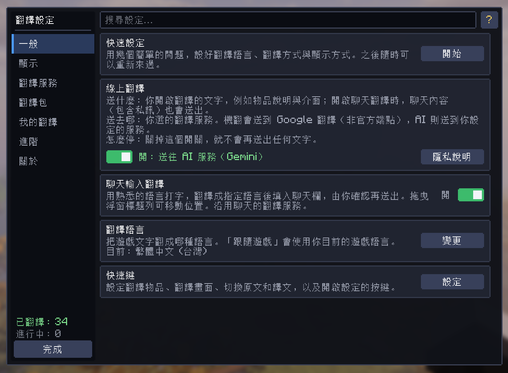

  

<strong>语言的界限，不是世界的界限。</strong>

  
  
  
  
  

<a href="README.en.md">English</a> · <a href="README.ja.md">日本語</a> · <a href="README.md">繁體中文</a> · <b>简体中文</b>

<a href="#主要功能">主要功能</a> &nbsp;·&nbsp; <a href="#下载">下载</a> &nbsp;·&nbsp; <a href="#游戏实机展示">实机展示</a> &nbsp;·&nbsp; <a href="#翻译来源">翻译来源</a> &nbsp;·&nbsp; <a href="#快捷键">快捷键</a> &nbsp;·&nbsp; <a href="#隐私">隐私说明</a>

> **首次安装时默认关闭在线翻译。** 开启后，选定内容会发送至你选择的服务，聊天可能包含私信；已有的本地翻译仍可离线显示。[阅读隐私说明](#隐私)。

## 主要功能

<table>
  <tr>
    <td width="50%" valign="top"><h3>✍️ 用自己的语言，自在回复</h3>
无需切出游戏查询翻译。在可自由拖动的聊天浮窗中写下想说的话，选好语言，译文就会填入聊天栏；确认无误后，再亲自发送。
</td>
    <td width="50%" valign="top"><h3>💬 跨越语言，跟上话题</h3>
聊天原文与译文一同显示，跟上队友的讨论，也保留原话的语气与上下文。
</td>
  </tr>
  <tr>
    <td width="50%" valign="top"><h3>📖 冒险，不再错过线索</h3>
从物品能力、任务故事到书本与界面，把看不懂的文字变成熟悉的语言，专注探索眼前的世界。
</td>
    <td width="50%" valign="top"><h3>🔥 先翻好，再出发</h3>
通过全内容预热提前准备想看的内容，也能自由选择类别。已保存的译文可以直接使用，把等待留在冒险之前。
</td>
  </tr>
  <tr>
    <td width="50%" valign="top"><h3>🌐 找到适合你的翻译方式</h3>
从 Google 到 AI，根据自己的需求选择服务，也能连接本地模型，打造顺手的游戏体验。
</td>
    <td width="50%" valign="top"><h3>💾 好翻译，一起用</h3>
下载现成翻译包快速上手，或把整理好的译文分享给朋友。翻译过的内容会保留下来，下次遇到时立即读懂。
</td>
  </tr>
</table>

模组 UI 跟随 Minecraft 客户端语言，支持英语、日语、繁体中文、简体中文；其他客户端语言使用英文 UI。这不会限制游戏内容可选的翻译目标语言。

## 游戏实机展示

### 用自己的语言回复

在可拖动的浮窗中输入中文，选择目标语言后将译文填入聊天栏；确认内容，再按 Enter 发送。

### 物品提示：翻译前与翻译后

同一个模组物品，翻译后仍保留名称与说明的文字颜色。点击图片可查看原始尺寸。

<table>
  <tr><th width="50%">原文</th><th width="50%">繁体中文翻译</th></tr>
  <tr>
    <td valign="top"></td>
    <td valign="top"></td>
  </tr>
</table>

### 聊天原文与译文并列

以上图片均截取自 Better MC 整合包中的实际游戏画面；译文未经修改。翻译质量与速度取决于所选服务。

查看更多：翻译设置界面

## 开始使用

1. **选择正确版本。** 从[下载](#下载)选择与 Minecraft 版本和 Loader 匹配的单个 JAR，放入该实例的 `mods` 文件夹；Fabric 还需要对应版本的 Fabric API。
2. **选择语言与服务。** 启动游戏，通过快速设置选择目标语言和翻译来源，确认后才会开启在线翻译。
3. **开始阅读。** 现代版本中，按 <kbd>R</kbd> 翻译鼠标指向的物品，按 <kbd>P</kbd> 翻译可见界面或 HUD；按 <kbd>G</kbd> 切换原文／译文。

| 使用方式 | 聊天 | 物品、界面与其他显示区域 |
| --- | --- | --- |
| Google 机器翻译 | 自动翻译 | 按 `R`／`P` 手动触发 |
| AI 翻译 | 自动翻译 | 自动翻译；`R`／`P` 强制重新翻译 |
| 已有译文 | 直接显示 | 直接显示，不重复发送请求 |

每个区域都可选择原文、译文或二者并列。已有 AI 译文优先，其次是翻译包与已保存的机器翻译。旧版按键有所不同，请参阅[快捷键](#快捷键)。

<!-- BEGIN GENERATED DOWNLOAD MATRIX -->
## 下载

完整支持范围请以表格为准：Fabric 提供 Minecraft 1.16.5 至 26.3 的所有正式版本，NeoForge 提供 1.20.1 至 26.3 的所有正式版本；另保留 Fabric 1.14.4、1.15.2 与 Forge 1.12.2、1.13.2。每个 JAR 仅适用于文件名所示的 Minecraft 版本与 Loader。

### 整包下载

| Fabric · 37 | NeoForge · 23 | Forge · 2 | 全部版本 |
| --- | --- | --- | --- |
| [下载 Fabric 版本包](https://github.com/DragonMeow1012/NyanLex/releases/download/v1.0.0/NyanLex-1.0.0-Fabric.zip) | [下载 NeoForge 版本包](https://github.com/DragonMeow1012/NyanLex/releases/download/v1.0.0/NyanLex-1.0.0-NeoForge.zip) | [下载 Forge 版本包](https://github.com/DragonMeow1012/NyanLex/releases/download/v1.0.0/NyanLex-1.0.0-Forge.zip) | [下载 全部版本](https://github.com/DragonMeow1012/NyanLex/releases/download/v1.0.0/NyanLex-1.0.0-all-versions.zip) |

按 Minecraft 系列展开并下载单独版本：

<b>旧版 1.12～1.15</b>

| Minecraft | Fabric | NeoForge | Forge | Java |
| --- | --- | --- | --- | ---: |
| 1.12.2 | — | — | [下载 Forge JAR](https://github.com/DragonMeow1012/NyanLex/releases/download/v1.0.0/nyanlex-1.0.0-Forge-1.12.2.jar) | 8 |
| 1.13.2 | — | — | [下载 Forge JAR](https://github.com/DragonMeow1012/NyanLex/releases/download/v1.0.0/nyanlex-1.0.0-Forge-1.13.2.jar) | 8 |
| 1.14.4 | [下载 Fabric JAR](https://github.com/DragonMeow1012/NyanLex/releases/download/v1.0.0/nyanlex-1.0.0-Fabric-1.14.4.jar) | — | — | 8 |
| 1.15.2 | [下载 Fabric JAR](https://github.com/DragonMeow1012/NyanLex/releases/download/v1.0.0/nyanlex-1.0.0-Fabric-1.15.2.jar) | — | — | 8 |

<b>Minecraft 1.16</b>

| Minecraft | Fabric | NeoForge | Forge | Java |
| --- | --- | --- | --- | ---: |
| 1.16.5 | [下载 Fabric JAR](https://github.com/DragonMeow1012/NyanLex/releases/download/v1.0.0/nyanlex-1.0.0-Fabric-1.16.5.jar) | — | — | 8 |

<b>Minecraft 1.17</b>

| Minecraft | Fabric | NeoForge | Forge | Java |
| --- | --- | --- | --- | ---: |
| 1.17 | [下载 Fabric JAR](https://github.com/DragonMeow1012/NyanLex/releases/download/v1.0.0/nyanlex-1.0.0-Fabric-1.17.jar) | — | — | 16 |
| 1.17.1 | [下载 Fabric JAR](https://github.com/DragonMeow1012/NyanLex/releases/download/v1.0.0/nyanlex-1.0.0-Fabric-1.17.1.jar) | — | — | 16 |

<b>Minecraft 1.18</b>

| Minecraft | Fabric | NeoForge | Forge | Java |
| --- | --- | --- | --- | ---: |
| 1.18 | [下载 Fabric JAR](https://github.com/DragonMeow1012/NyanLex/releases/download/v1.0.0/nyanlex-1.0.0-Fabric-1.18.jar) | — | — | 17 |
| 1.18.1 | [下载 Fabric JAR](https://github.com/DragonMeow1012/NyanLex/releases/download/v1.0.0/nyanlex-1.0.0-Fabric-1.18.1.jar) | — | — | 17 |
| 1.18.2 | [下载 Fabric JAR](https://github.com/DragonMeow1012/NyanLex/releases/download/v1.0.0/nyanlex-1.0.0-Fabric-1.18.2.jar) | — | — | 17 |

<b>Minecraft 1.19</b>

| Minecraft | Fabric | NeoForge | Forge | Java |
| --- | --- | --- | --- | ---: |
| 1.19 | [下载 Fabric JAR](https://github.com/DragonMeow1012/NyanLex/releases/download/v1.0.0/nyanlex-1.0.0-Fabric-1.19.jar) | — | — | 17 |
| 1.19.1 | [下载 Fabric JAR](https://github.com/DragonMeow1012/NyanLex/releases/download/v1.0.0/nyanlex-1.0.0-Fabric-1.19.1.jar) | — | — | 17 |
| 1.19.2 | [下载 Fabric JAR](https://github.com/DragonMeow1012/NyanLex/releases/download/v1.0.0/nyanlex-1.0.0-Fabric-1.19.2.jar) | — | — | 17 |
| 1.19.3 | [下载 Fabric JAR](https://github.com/DragonMeow1012/NyanLex/releases/download/v1.0.0/nyanlex-1.0.0-Fabric-1.19.3.jar) | — | — | 17 |
| 1.19.4 | [下载 Fabric JAR](https://github.com/DragonMeow1012/NyanLex/releases/download/v1.0.0/nyanlex-1.0.0-Fabric-1.19.4.jar) | — | — | 17 |

<b>Minecraft 1.20</b>

| Minecraft | Fabric | NeoForge | Forge | Java |
| --- | --- | --- | --- | ---: |
| 1.20 | [下载 Fabric JAR](https://github.com/DragonMeow1012/NyanLex/releases/download/v1.0.0/nyanlex-1.0.0-Fabric-1.20.jar) | — | — | 17 |
| 1.20.1 | [下载 Fabric JAR](https://github.com/DragonMeow1012/NyanLex/releases/download/v1.0.0/nyanlex-1.0.0-Fabric-1.20.1.jar) | [下载 NeoForge JAR](https://github.com/DragonMeow1012/NyanLex/releases/download/v1.0.0/nyanlex-1.0.0-NeoForge-1.20.1.jar) | — | 17 |
| 1.20.2 | [下载 Fabric JAR](https://github.com/DragonMeow1012/NyanLex/releases/download/v1.0.0/nyanlex-1.0.0-Fabric-1.20.2.jar) | [下载 NeoForge JAR](https://github.com/DragonMeow1012/NyanLex/releases/download/v1.0.0/nyanlex-1.0.0-NeoForge-1.20.2.jar) | — | 17 |
| 1.20.3 | [下载 Fabric JAR](https://github.com/DragonMeow1012/NyanLex/releases/download/v1.0.0/nyanlex-1.0.0-Fabric-1.20.3.jar) | [下载 NeoForge JAR](https://github.com/DragonMeow1012/NyanLex/releases/download/v1.0.0/nyanlex-1.0.0-NeoForge-1.20.3.jar) | — | 17 |
| 1.20.4 | [下载 Fabric JAR](https://github.com/DragonMeow1012/NyanLex/releases/download/v1.0.0/nyanlex-1.0.0-Fabric-1.20.4.jar) | [下载 NeoForge JAR](https://github.com/DragonMeow1012/NyanLex/releases/download/v1.0.0/nyanlex-1.0.0-NeoForge-1.20.4.jar) | — | 17 |
| 1.20.5 | [下载 Fabric JAR](https://github.com/DragonMeow1012/NyanLex/releases/download/v1.0.0/nyanlex-1.0.0-Fabric-1.20.5.jar) | [下载 NeoForge JAR](https://github.com/DragonMeow1012/NyanLex/releases/download/v1.0.0/nyanlex-1.0.0-NeoForge-1.20.5.jar) | — | 21 |
| 1.20.6 | [下载 Fabric JAR](https://github.com/DragonMeow1012/NyanLex/releases/download/v1.0.0/nyanlex-1.0.0-Fabric-1.20.6.jar) | [下载 NeoForge JAR](https://github.com/DragonMeow1012/NyanLex/releases/download/v1.0.0/nyanlex-1.0.0-NeoForge-1.20.6.jar) | — | 21 |

<b>Minecraft 1.21</b>

| Minecraft | Fabric | NeoForge | Forge | Java |
| --- | --- | --- | --- | ---: |
| 1.21 | [下载 Fabric JAR](https://github.com/DragonMeow1012/NyanLex/releases/download/v1.0.0/nyanlex-1.0.0-Fabric-1.21.jar) | [下载 NeoForge JAR](https://github.com/DragonMeow1012/NyanLex/releases/download/v1.0.0/nyanlex-1.0.0-NeoForge-1.21.jar) | — | 21 |
| 1.21.1 | [下载 Fabric JAR](https://github.com/DragonMeow1012/NyanLex/releases/download/v1.0.0/nyanlex-1.0.0-Fabric-1.21.1.jar) | [下载 NeoForge JAR](https://github.com/DragonMeow1012/NyanLex/releases/download/v1.0.0/nyanlex-1.0.0-NeoForge-1.21.1.jar) | — | 21 |
| 1.21.2 | [下载 Fabric JAR](https://github.com/DragonMeow1012/NyanLex/releases/download/v1.0.0/nyanlex-1.0.0-Fabric-1.21.2.jar) | [下载 NeoForge JAR](https://github.com/DragonMeow1012/NyanLex/releases/download/v1.0.0/nyanlex-1.0.0-NeoForge-1.21.2.jar) | — | 21 |
| 1.21.3 | [下载 Fabric JAR](https://github.com/DragonMeow1012/NyanLex/releases/download/v1.0.0/nyanlex-1.0.0-Fabric-1.21.3.jar) | [下载 NeoForge JAR](https://github.com/DragonMeow1012/NyanLex/releases/download/v1.0.0/nyanlex-1.0.0-NeoForge-1.21.3.jar) | — | 21 |
| 1.21.4 | [下载 Fabric JAR](https://github.com/DragonMeow1012/NyanLex/releases/download/v1.0.0/nyanlex-1.0.0-Fabric-1.21.4.jar) | [下载 NeoForge JAR](https://github.com/DragonMeow1012/NyanLex/releases/download/v1.0.0/nyanlex-1.0.0-NeoForge-1.21.4.jar) | — | 21 |
| 1.21.5 | [下载 Fabric JAR](https://github.com/DragonMeow1012/NyanLex/releases/download/v1.0.0/nyanlex-1.0.0-Fabric-1.21.5.jar) | [下载 NeoForge JAR](https://github.com/DragonMeow1012/NyanLex/releases/download/v1.0.0/nyanlex-1.0.0-NeoForge-1.21.5.jar) | — | 21 |
| 1.21.6 | [下载 Fabric JAR](https://github.com/DragonMeow1012/NyanLex/releases/download/v1.0.0/nyanlex-1.0.0-Fabric-1.21.6.jar) | [下载 NeoForge JAR](https://github.com/DragonMeow1012/NyanLex/releases/download/v1.0.0/nyanlex-1.0.0-NeoForge-1.21.6.jar) | — | 21 |
| 1.21.7 | [下载 Fabric JAR](https://github.com/DragonMeow1012/NyanLex/releases/download/v1.0.0/nyanlex-1.0.0-Fabric-1.21.7.jar) | [下载 NeoForge JAR](https://github.com/DragonMeow1012/NyanLex/releases/download/v1.0.0/nyanlex-1.0.0-NeoForge-1.21.7.jar) | — | 21 |
| 1.21.8 | [下载 Fabric JAR](https://github.com/DragonMeow1012/NyanLex/releases/download/v1.0.0/nyanlex-1.0.0-Fabric-1.21.8.jar) | [下载 NeoForge JAR](https://github.com/DragonMeow1012/NyanLex/releases/download/v1.0.0/nyanlex-1.0.0-NeoForge-1.21.8.jar) | — | 21 |
| 1.21.9 | [下载 Fabric JAR](https://github.com/DragonMeow1012/NyanLex/releases/download/v1.0.0/nyanlex-1.0.0-Fabric-1.21.9.jar) | [下载 NeoForge JAR](https://github.com/DragonMeow1012/NyanLex/releases/download/v1.0.0/nyanlex-1.0.0-NeoForge-1.21.9.jar) | — | 21 |
| 1.21.10 | [下载 Fabric JAR](https://github.com/DragonMeow1012/NyanLex/releases/download/v1.0.0/nyanlex-1.0.0-Fabric-1.21.10.jar) | [下载 NeoForge JAR](https://github.com/DragonMeow1012/NyanLex/releases/download/v1.0.0/nyanlex-1.0.0-NeoForge-1.21.10.jar) | — | 21 |
| 1.21.11 | [下载 Fabric JAR](https://github.com/DragonMeow1012/NyanLex/releases/download/v1.0.0/nyanlex-1.0.0-Fabric-1.21.11.jar) | [下载 NeoForge JAR](https://github.com/DragonMeow1012/NyanLex/releases/download/v1.0.0/nyanlex-1.0.0-NeoForge-1.21.11.jar) | — | 21 |

<b>Minecraft 26</b>

| Minecraft | Fabric | NeoForge | Forge | Java |
| --- | --- | --- | --- | ---: |
| 26.1 | [下载 Fabric JAR](https://github.com/DragonMeow1012/NyanLex/releases/download/v1.0.0/nyanlex-1.0.0-Fabric-26.1.jar) | [下载 NeoForge JAR](https://github.com/DragonMeow1012/NyanLex/releases/download/v1.0.0/nyanlex-1.0.0-NeoForge-26.1.jar) | — | 25 |
| 26.1.1 | [下载 Fabric JAR](https://github.com/DragonMeow1012/NyanLex/releases/download/v1.0.0/nyanlex-1.0.0-Fabric-26.1.1.jar) | [下载 NeoForge JAR](https://github.com/DragonMeow1012/NyanLex/releases/download/v1.0.0/nyanlex-1.0.0-NeoForge-26.1.1.jar) | — | 25 |
| 26.1.2 | [下载 Fabric JAR](https://github.com/DragonMeow1012/NyanLex/releases/download/v1.0.0/nyanlex-1.0.0-Fabric-26.1.2.jar) | [下载 NeoForge JAR](https://github.com/DragonMeow1012/NyanLex/releases/download/v1.0.0/nyanlex-1.0.0-NeoForge-26.1.2.jar) | — | 25 |
| 26.2 | [下载 Fabric JAR](https://github.com/DragonMeow1012/NyanLex/releases/download/v1.0.0/nyanlex-1.0.0-Fabric-26.2.jar) | [下载 NeoForge JAR](https://github.com/DragonMeow1012/NyanLex/releases/download/v1.0.0/nyanlex-1.0.0-NeoForge-26.2.jar) | — | 25 |
| 26.3 | [下载 Fabric JAR](https://github.com/DragonMeow1012/NyanLex/releases/download/v1.0.0/nyanlex-1.0.0-Fabric-26.3.jar) | [下载 NeoForge JAR](https://github.com/DragonMeow1012/NyanLex/releases/download/v1.0.0/nyanlex-1.0.0-NeoForge-26.3.jar) | — | 25 |

<!-- END GENERATED DOWNLOAD MATRIX -->

## 兼容性

- 支持 Fabric、NeoForge 和 Forge（Minecraft 1.12.2～26.3），完整列表见[下载](#下载)。
- 旧版目标（Fabric 1.14.4～1.16.5、Forge 1.12.2～1.13.2）使用精简界面：包含简短的快速设置、即时确认窗口与分类设置界面，但没有翻译包和全内容预热。
- 针对整合包任务书（任务说明）的翻译做了额外优化，包括长段落、彩色文字与提示框。
- 这是纯客户端模组，不会修改服务器，也不会代替玩家发送聊天消息。

## 翻译来源

| 来源 | API Key／登录 | 说明 |
| --- | --- | --- |
| Google 机器翻译 | 不需要 | 使用非官方网页端点；主入口遇到 429／拦截页时会尝试兼容的备用入口，两个入口都失败后才会暂停并退避。服务仍可能受到限流或停止工作。 |
| Gemini | 自备 API Key | 设置界面提供预设按钮，通过 OpenAI 兼容接口连接，可自行选择模型。 |
| Google／Antigravity 登录 | Google 登录 | 现代 Fabric／NeoForge 版本支持。请先从[官方下载页](https://antigravity.google/download)安装 Antigravity CLI，再从 Gemini 分页切换到“Google 登录”；翻译使用该账号的 Antigravity 额度，模型（包括思考强度版本）由 CLI 提供。 |
| OpenAI | 自备 API Key | 设置界面提供预设按钮，可设置模型与服务网址。 |
| DeepSeek | 自备 API Key | 设置界面提供预设按钮，可设置模型与服务网址。 |
| OpenRouter | 自备 API Key | 在 AI 设置中填入其 OpenAI 兼容服务网址与模型。 |
| Ollama／LM Studio | 取决于本地服务；无需验证时可留空 | 连接到你自行运行的 OpenAI 兼容服务器；模型需自行准备。 |
| 其他 OpenAI 兼容服务 | 取决于服务 | 可自定义 Base URL、模型、轮换 API Key 与术语表。Key 留空时不发送 `Authorization` 标头。 |
| ChatGPT／Codex | ChatGPT 登录 | 所有列出的版本均支持；需先安装 Codex CLI。可选择模型、推理强度并查看 token，使用账户的 Codex 额度。 |

NyanLex 不会自动安装上述 CLI。登录流程由本地官方工具在浏览器或终端中完成；账号凭据由官方工具保存，NyanLex 只调用已登录的本地进程。

你可以选择 AI 失败时是否使用 Google 机器翻译补上；启用回退后，该文本也可能被发送到 Google。

本地缓存、导入的译文、已下载的翻译包以及内置术语表可直接提供已有翻译，无需再次向服务发送请求。翻译包的来源、格式与许可见[翻译仓库说明](translation-hub/README.md)。

## 全内容预热

打开 **翻译设置 → 我的翻译**，在右侧展开“分类”，可选择“物品名称与说明”和“界面文字”，两项默认都已选中。任务标题与说明属于界面文字。只有按下“开始”或“继续”才会执行，已有译文会被跳过；任务可以暂停、继续或停止。此功能需要 AI 翻译，若在线翻译处于关闭状态会先询问。部分界面内容只有进入世界后才会加载，因此请先进入世界再开始预热。

遇到限流暂停时可手动继续；切换模型后会检查新模型的状态。Google 的 429 暂停与退避保护仍然有效。

## 翻译包与分享

翻译包是由维护者整理并托管在 GitHub 上的现成 AI 翻译。模组启动时不会自动检查。获取方式有两种：快速设置的最后一页会自动检测（仅在找到与你已安装模组相符的翻译包时出现），以及在 翻译设置 → 翻译包 中点击“检测并下载翻译包”。两种方式都会列出每个翻译包的大小与预计总大小，只有在你确认后才会下载，并将内容合并到本地已保存的翻译中。同一分类中的“清除已下载的翻译包”只会移除来自翻译包的内容，不影响你自己生成的翻译。此功能只读取 `index.json` 和你确认的文件，不会上传任何个人数据或翻译内容。翻译包只包含译文与哈希，不含原文，并采用 CC BY-NC-SA 4.0 许可，详见 [translation-hub/README.md](translation-hub/README.md)。

### 分享翻译

在翻译设置中选择“导出翻译”，把生成的 JSON 发送给朋友。**支持自动分卷导出和批量合并导入**：数据较少时生成一个文件；超过每份上限时，自动生成 `translations.part-0001.json`、`translations.part-0002.json` 等文件，请一起分享同一批文件。朋友选择相同的目标语言，再点击“导入翻译”，使用 Ctrl／Shift 一次选择多个 JSON。导入只补充缺少的有效翻译，不覆盖现有内容，也不会发送翻译请求。文件不包含 API Key、登录信息或模组设置。

格式兼容性、分卷与导入限制

Fabric 1.17 及以上版本与 NeoForge 可以相互分享；Fabric 1.14.4～1.16.5 与 Forge 1.12.2～1.13.2 可以相互分享。这两个系列使用不同的文本模板格式，无法跨系列导入。**每个**文件最多 32 MiB、100,000 条翻译；这并非整批分享的总量上限，超过时会自动分卷。现有的单文件 JSON 仍然兼容；旧版超大 JSON 请由持有缓存的一方重新导出。

批量导入会按文件名顺序逐个合并，先导入的有效译文优先。单个文件损坏、格式不兼容或容量不足，不会阻止其他文件继续处理。完成消息会显示新增翻译数、成功／总文件数与失败信息；已成功导入的内容不会回滚。导出不会覆盖同名文件，如目标文件已存在，请更换名称。

旧版共享缓存仍限制为 8,192 条；如果合并某个文件后会超过剩余容量，该文件会被拒绝，以免挤掉现有翻译。现代版本的每个磁盘缓存默认最多保留 100,000 条，超出后仍会按现有缓存策略淘汰旧条目。自动分卷不会提高游戏客户端的缓存容量。

## 快捷键

Fabric 1.17 及以上版本与 NeoForge：

| 按键 | 功能 |
| --- | --- |
| `G` | 切换原文／译文显示 |
| `R` | 翻译／重新翻译鼠标指向的物品 |
| `P` | 翻译／重新翻译当前界面的可见文字与提示框 |
| 未绑定 | 打开翻译设置 |

旧版界面：

| 目标版本 | 按键 |
| --- | --- |
| Fabric 1.14.4～1.16.5 | `G` 打开翻译设置；`P` 重新翻译当前界面 |
| Forge 1.12.2～1.13.2 | `G` 打开翻译设置；`H` 启用／禁用翻译；`P` 重新翻译当前界面 |

你可以从设置菜单打开翻译设置；如果入口被其他 UI 模组隐藏，也可以在聊天栏输入 `/nyanlex`。

`P` 会捕获当前可见的文字，包括鼠标悬停的提示框；未打开界面时，它会捕获画面上可见的 HUD 文字（计分板、Boss Bar、标题、Action Bar、名称标签）。它不会扫描屏幕外内容，也不会在输入文字时触发。使用机器翻译时，聊天以外的内容都按需翻译（见上方“开始使用”），因此要通过 `R`／`P` 获取翻译；使用 AI 时则会自动翻译，`R`／`P` 会强制重新翻译。完成时间取决于所选翻译服务。

从旧项目名称升级：设置、缓存与快捷键迁移

如果升级后快捷键恢复默认值：此版本将模组 id 更改为 `nyanlex`。首次启动时会自动把旧版（包括更早使用过的名称）的配置文件、翻译缓存，以及 `options.txt` 中的旧快捷键复制到新名称下（旧文件会保留，不会删除），且只执行一次。如果新名称下已经存在翻译缓存，旧缓存会合并进去（新文件中已有的条目优先），同样只执行一次，因此之后清除或删除的缓存不会再次出现。

更多设置与翻译行为

**聊天输入翻译**：在“常规”中启用后，按聊天快捷键即可输入草稿。浮窗默认位于右下角，已有保存位置则予以保留；拖动标题栏可移动并记住位置。目标语言默认为英语，菜单可搜索语言名称或代码。按 Esc 关闭聊天后，同一次游戏运行期间会保留草稿，再次打开即可继续输入。点击“翻译并填入”后，请先确认聊天栏中的译文，再按 Enter 发送。

所有支持的版本都包含 ChatGPT／Codex 登录、模型与推理强度选择，以及会话 token 显示；默认使用 `gpt-5.6-terra`／`medium`。

异步批处理、优先级队列、磁盘缓存与失败退避可以减少主线程工作和重复请求。发送间隔与收集窗口默认均为 5 秒，共有关闭或 1～10 秒这 11 个选项。

玩家名会根据 TAB 列表在本地遮罩。现代版本会跳过仅由已知模组、光影或技术名称及其版本号构成的标签；已有翻译仍然优先。

**提示框分段缓存**：长提示框（标题加多行正文）会按段缓存与恢复，因此只有真正发生变化的段落需要重新请求。

**设置界面分为七个分类**（Esc → 选项 → 翻译设置…）：常规、显示、翻译服务、翻译包、我的翻译、高级和关于，并带有搜索框与游戏内手册。“常规”中的“快速设置”可随时重新运行；“不翻译词汇”可让服务器或品牌名称保持原文（不区分大小写、整词匹配）。

## 隐私

- **新安装时“在线翻译”默认关闭。** 关闭时，任何翻译服务都不会收到你的文字。
- 有三种开启方式：第一次进入标题界面时会自动出现“快速设置”（可选择机器翻译、AI 翻译或“暂不设置”；按下“完成”之前不会应用任何选择，也不会发送文字）；在线翻译关闭时按翻译物品键（默认 `R`）或翻译界面键（默认 `P`），会先弹出确认窗口，只有按下“开始翻译”后才会发送；或在 翻译设置 → 常规 中开启“在线翻译”。
- 无需开启也能使用且不会发送任何内容的功能包括：已有的本地翻译缓存、已下载的翻译包、内置术语表，以及游戏自身语言文件中的原版文本。
- 开启后，会发送你设置为需要翻译的文字（物品说明、界面等）。如果启用聊天翻译，聊天内容也会发送，**包括私信**。
- 聊天输入翻译仅在你点击“翻译并填入”（或在浮窗中按 Enter）时发送草稿；关闭聊天后，草稿仅保留在内存中，退出游戏后不保留；不会写入翻译缓存，也不会包含在翻译导出文件中。填入后仍由你确认是否发送。
- 文字会发送至你选择的翻译服务：
  - **机器翻译（Google，无需 Key）**使用**非官方**网页端点，随时可能受到限流或停止工作。
  - **AI 引擎**（OpenAI 兼容服务，例如 Gemini、OpenAI、DeepSeek，或 ChatGPT／Codex 登录）同样需要自备 Key 或登录，只会发送到你自行配置的服务。使用 ChatGPT 登录时会消耗你账户的 Codex 额度。
- **API Key 只保存在本地配置文件中**，并且只会发送给你选择的服务提供商；设置界面会将其遮罩，也不会写入日志或调试文件。
- 从旧版升级的用户会保留原有设置：原本已在使用翻译的用户，其在线翻译会保持开启。
- **翻译包只会下载，不会上传。** 检测与下载翻译包只会从 GitHub 读取公开文件（`index.json` 及你确认的文件），不会发送任何文字或你的模组列表；在确认之前不会下载任何内容。
- TAB 列表中的玩家名会先在本地遮罩；其他服务器文字仍可能包含用户提供的内容。

## 关于 NyanLex

[查看此版本的更新说明](https://github.com/DragonMeow1012/NyanLex/releases/tag/v1.0.0)。

各版本的构建方式与 Release 文件夹结构请参阅 [PACKAGING.md](PACKAGING.md)。如有问题，请提交至 [GitHub Issues](https://github.com/DragonMeow1012/NyanLex/issues)。

代码采用 [MIT](LICENSE) 许可；翻译包另有来源与许可说明，详见[翻译仓库](translation-hub/README.md)。

本项目为非官方作品，与 Mojang、Microsoft 或其他模组作者不存在从属、赞助或背书关系。Minecraft 是 Mojang AB／Microsoft 的商标。
