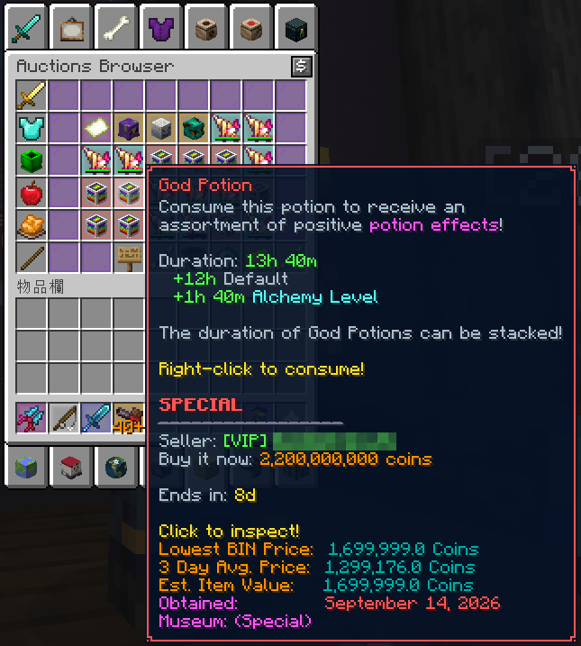
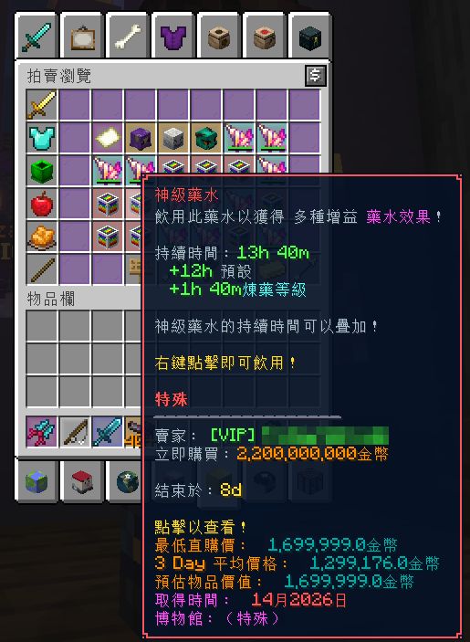
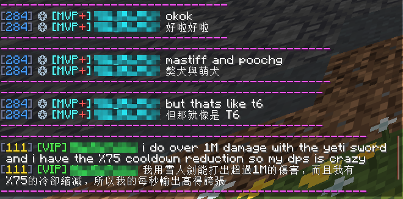
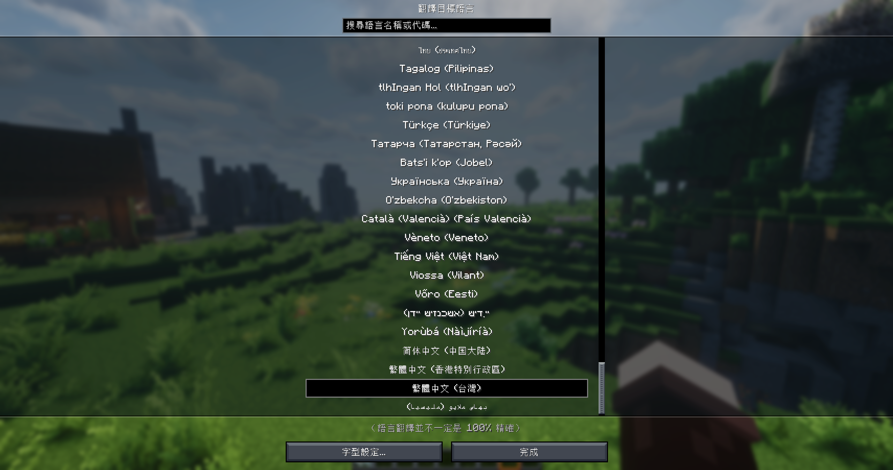

  

<strong>用熟悉的語言，讀懂 Minecraft 裡的聊天、物品與介面。</strong> 純客戶端翻譯 · 原文與譯文並列 · 已有翻譯直接沿用

  
  
  
  

<a href="README.md">English</a> · <b>繁體中文</b>

<a href="#直接下載">下載</a> &nbsp;·&nbsp; <a href="#實際遊戲展示">實機展示</a> &nbsp;·&nbsp; <a href="#翻譯來源">翻譯來源</a> &nbsp;·&nbsp; <a href="#快捷鍵">快捷鍵</a> &nbsp;·&nbsp; <a href="#隱私">隱私說明</a>

> **首次安裝預設關閉線上翻譯。** 開啟後，選定內容會傳送至你選擇的服務，聊天可能包含私訊；已有的本機翻譯仍可離線顯示。[閱讀隱私說明](#隱私)。

<table>
  <tr>
    <td width="50%" valign="top"><h3>💬 聊天看得懂</h3>
聊天可同時顯示原文與譯文，和其他玩家交流時保留對照。
</td>
    <td width="50%" valign="top"><h3>📖 物品與介面</h3>
翻譯物品說明、書本、任務文字，以及支援的 HUD 和模組介面。
</td>
  </tr>
  <tr>
    <td width="50%" valign="top"><h3>🌐 翻譯服務自己選</h3>
Google、AI API 或 ChatGPT／Codex，也可連接本機模型。
</td>
    <td width="50%" valign="top"><h3>💾 翻過就留著</h3>
沿用快取、下載翻譯包，或匯入朋友分享的譯文。
</td>
  </tr>
</table>

## 實際遊戲展示

### 物品提示：翻譯前與翻譯後

閱讀完整物品說明，同時保留數值與文字顏色。點圖片可看原尺寸。

<table>
  <tr><th width="50%">原文</th><th width="50%">繁體中文翻譯</th></tr>
  <tr>
    <td valign="top"></td>
    <td valign="top"></td>
  </tr>
</table>

### 聊天原文與譯文並列

以上為實際遊戲截圖，玩家名稱已打碼；譯文未改動。翻譯品質與速度取決於所選服務。

查看更多：翻譯目標語言選擇

## 開始使用

1. **選對版本。** [下載](#直接下載)符合 Minecraft 版本與 Loader 的單一 JAR，放入該實例的 `mods` 資料夾；Fabric 另需對應的 Fabric API。
2. **選擇語言與服務。** 啟動遊戲，透過快速設定選擇目標語言和翻譯來源，確認後才開啟線上翻譯。
3. **開始閱讀。** 現代版按 <kbd>R</kbd> 翻譯游標指向的物品，按 <kbd>P</kbd> 翻譯可見介面或 HUD；按 <kbd>G</kbd> 切換原文／譯文。

| 使用方式 | 聊天 | 物品、介面與其他顯示區域 |
| --- | --- | --- |
| Google 機器翻譯 | 自動翻譯 | 按 `R`／`P` 手動觸發 |
| AI 翻譯 | 自動翻譯 | 自動翻譯；`R`／`P` 強制重翻 |
| 已有的譯文 | 直接顯示 | 直接顯示，不重複送出 |

每個區域可選原文、譯文或兩者並列。已有 AI 譯文優先，其次是翻譯包與已存的機翻。舊版按鍵有差異，見[快捷鍵](#快捷鍵)。

## 直接下載

每個 JAR 只適用於檔名標示的 Minecraft 版本與 Loader。**請只安裝其中一個，不要一次安裝整包。**

| Fabric · 12 個版本 | NeoForge · 4 個版本 | Forge · 2 個版本 |
| :---: | :---: | :---: |
| 1.14.4～26.3 的指定版本 | 1.20.1、1.21.1、26.2、26.3 | 1.12.2、1.13.2 |
| [Fabric ZIP](https://github.com/DragonMeow1012/NyanLex/releases/download/v1.0.0/NyanLex-1.0.0-Fabric.zip) | [NeoForge ZIP](https://github.com/DragonMeow1012/NyanLex/releases/download/v1.0.0/NyanLex-1.0.0-NeoForge.zip) | [Forge ZIP](https://github.com/DragonMeow1012/NyanLex/releases/download/v1.0.0/NyanLex-1.0.0-Forge.zip) |

[查看 Release](https://github.com/DragonMeow1012/NyanLex/releases/tag/v1.0.0) · [全版本 ZIP](https://github.com/DragonMeow1012/NyanLex/releases/download/v1.0.0/NyanLex-1.0.0-all-versions.zip) · [SHA-256](https://github.com/DragonMeow1012/NyanLex/releases/download/v1.0.0/SHA256SUMS.txt)

展開下方清單，下載你的版本：

<b>Fabric · 12 個版本 — 個別 JAR 與 Java 需求</b>

Fabric 版本需要相符版本的 Fabric Loader 與 Fabric API。

| Minecraft | Java | 下載 |
| --- | ---: | --- |
| 1.14.4 | 8 | [下載 JAR](https://github.com/DragonMeow1012/NyanLex/releases/download/v1.0.0/nyanlex-1.0.0-Fabric-1.14.4.jar) |
| 1.15.2 | 8 | [下載 JAR](https://github.com/DragonMeow1012/NyanLex/releases/download/v1.0.0/nyanlex-1.0.0-Fabric-1.15.2.jar) |
| 1.16.5 | 8 | [下載 JAR](https://github.com/DragonMeow1012/NyanLex/releases/download/v1.0.0/nyanlex-1.0.0-Fabric-1.16.5.jar) |
| 1.17.1 | 16 | [下載 JAR](https://github.com/DragonMeow1012/NyanLex/releases/download/v1.0.0/nyanlex-1.0.0-Fabric-1.17.1.jar) |
| 1.18.2 | 17 | [下載 JAR](https://github.com/DragonMeow1012/NyanLex/releases/download/v1.0.0/nyanlex-1.0.0-Fabric-1.18.2.jar) |
| 1.19.4 | 17 | [下載 JAR](https://github.com/DragonMeow1012/NyanLex/releases/download/v1.0.0/nyanlex-1.0.0-Fabric-1.19.4.jar) |
| 1.20.1 | 17 | [下載 JAR](https://github.com/DragonMeow1012/NyanLex/releases/download/v1.0.0/nyanlex-1.0.0-Fabric-1.20.1.jar) |
| 1.21.1 | 21 | [下載 JAR](https://github.com/DragonMeow1012/NyanLex/releases/download/v1.0.0/nyanlex-1.0.0-Fabric-1.21.1.jar) |
| 1.21.11 | 21 | [下載 JAR](https://github.com/DragonMeow1012/NyanLex/releases/download/v1.0.0/nyanlex-1.0.0-Fabric-1.21.11.jar) |
| 26.1.2 | 25 | [下載 JAR](https://github.com/DragonMeow1012/NyanLex/releases/download/v1.0.0/nyanlex-1.0.0-Fabric-26.1.2.jar) |
| 26.2 | 25 | [下載 JAR](https://github.com/DragonMeow1012/NyanLex/releases/download/v1.0.0/nyanlex-1.0.0-Fabric-26.2.jar) |
| 26.3 | 25 | [下載 JAR](https://github.com/DragonMeow1012/NyanLex/releases/download/v1.0.0/nyanlex-1.0.0-Fabric-26.3.jar) |

<b>NeoForge · 4 個版本 — 個別 JAR 與 Java 需求</b>

| Minecraft | Java | 下載 |
| --- | ---: | --- |
| 1.20.1 | 17 | [下載 JAR](https://github.com/DragonMeow1012/NyanLex/releases/download/v1.0.0/nyanlex-1.0.0-NeoForge-1.20.1.jar) |
| 1.21.1 | 21 | [下載 JAR](https://github.com/DragonMeow1012/NyanLex/releases/download/v1.0.0/nyanlex-1.0.0-NeoForge-1.21.1.jar) |
| 26.2 | 25 | [下載 JAR](https://github.com/DragonMeow1012/NyanLex/releases/download/v1.0.0/nyanlex-1.0.0-NeoForge-26.2.jar) |
| 26.3 | 25 | [下載 JAR](https://github.com/DragonMeow1012/NyanLex/releases/download/v1.0.0/nyanlex-1.0.0-NeoForge-26.3.jar) |

<b>Forge · 2 個版本 — 個別 JAR 與 Java 需求</b>

| Minecraft | Java | 下載 |
| --- | ---: | --- |
| 1.12.2 | 8 | [下載 JAR](https://github.com/DragonMeow1012/NyanLex/releases/download/v1.0.0/nyanlex-1.0.0-Forge-1.12.2.jar) |
| 1.13.2 | 8 | [下載 JAR](https://github.com/DragonMeow1012/NyanLex/releases/download/v1.0.0/nyanlex-1.0.0-Forge-1.13.2.jar) |

## 相容性

- 支援 Fabric、NeoForge、Forge（Minecraft 1.12.2～26.3），清單見下方。
- 舊版目標（Fabric 1.14.4～1.16.5、Forge 1.12.2～1.13.2）使用精簡版介面：有簡短的快速設定、即時詢問的確認視窗與分類設定畫面，但沒有翻譯包與全內容預熱。
- 針對模組包的任務書（任務說明）翻譯有特別優化（長段落、彩色文字、提示框）。
- 純客戶端模組，不修改伺服器，也不會代替玩家送出聊天。

## 翻譯來源

| 來源 | API Key／登入 | 說明 |
| --- | --- | --- |
| Google 機器翻譯 | 不需要 | 使用非官方網頁端點，可能被限流或失效；保留 429 暫停與退避機制。 |
| Gemini | 自備 API Key | 設定畫面有預設按鈕，透過 OpenAI 相容介面連線，可自行選擇模型。 |
| OpenAI | 自備 API Key | 設定畫面有預設按鈕，可設定模型與服務網址。 |
| DeepSeek | 自備 API Key | 設定畫面有預設按鈕，可設定模型與服務網址。 |
| OpenRouter | 自備 API Key | 在 AI 設定填入其 OpenAI 相容服務網址與模型。 |
| Ollama／LM Studio | 依本機服務設定，無驗證時可留空 | 連線到自己啟動的 OpenAI 相容伺服器；模型需自行準備。 |
| 其他 OpenAI 相容服務 | 依服務設定 | 可自訂 Base URL、模型、多把輪替金鑰與詞彙表。金鑰留空時不送出 `Authorization` 標頭。 |
| ChatGPT／Codex | ChatGPT 登入 | 所有表列版本均支援；需先安裝 Codex CLI。可選模型、推理強度並查看 token，使用帳號的 Codex 額度。 |

AI 失敗時是否使用 Google 機翻補上，可在設定中選擇；啟用回退時，該文字可能也會送到 Google。

本機快取、匯入的譯文、已下載的翻譯包及內建譯名表可直接提供已有翻譯，不必重新向服務送出請求。翻譯包的來源、格式與授權見 [翻譯倉庫說明](translation-hub/README.md)。

## 全內容預熱

在 **翻譯設定 → 我的翻譯** 展開右側「分類」，可選「物品名稱與說明」及「介面文字」，預設全部勾選。任務標題與描述歸在介面文字。按「開始」或「繼續」才會執行，已有譯文會略過；可暫停、繼續或停止。需要使用 AI 翻譯，線上翻譯關閉時會先詢問。部分介面內容進入世界後才載入，需進入世界後再按預熱。

遇到限流暫停時可手動繼續；換模型後會檢查新模型狀態。Google 的 429 暫停與退避保護維持不變。

## 翻譯包與分享

翻譯包是由維護者整理、放在 GitHub 上的現成 AI 翻譯。模組啟動時不會自動檢查，取得方式有兩種：快速設定的最後一頁會自動偵測（只有找到你已安裝模組的翻譯包時才會出現），以及到 翻譯設定 → 翻譯包 按「偵測並下載翻譯包」。兩種方式都會列出每個翻譯包的大小與預計總大小，由你確認後才下載，並合併到本機已存的翻譯；同一個分類的「清除下載的翻譯包」只會移除來自翻譯包的翻譯，你自己翻的不受影響。只會讀取 `index.json` 與你確認的檔案，不會上傳任何個人資料或翻譯內容。翻譯包內容只含譯文與雜湊、不含原文，資料以 CC BY-NC-SA 4.0 授權，詳見 [translation-hub/README.md](translation-hub/README.md)。

### 分享翻譯

在翻譯設定選擇「匯出翻譯」，把產生的 JSON 傳給朋友。**支援自動分檔匯出與批次合併匯入**：資料較少時產生單一檔案；超過每份上限時，自動產生 `translations.part-0001.json`、`translations.part-0002.json` 等檔案，請把同一批檔案一起分享。朋友選擇相同目標語言，再按「匯入翻譯」，使用 Ctrl／Shift 一次選取多份 JSON。匯入只補齊缺少的有效翻譯，不覆蓋已有內容，也不送出翻譯請求。檔案不包含 API Key、登入資料或模組設定。

格式相容性、分檔與匯入限制

Fabric 1.17.1 以上與 NeoForge 可互相分享；Fabric 1.14.4～1.16.5 與 Forge 1.12.2～1.13.2 可互相分享。這兩組的文字模板格式不同，不能跨組匯入。**每份**檔案上限為 32 MiB、10 萬筆翻譯；這不是整批分享的總量上限，超過時會自動分檔。既有單檔 JSON 仍可匯入；超過上限的舊 JSON 請由持有快取的一方重新匯出。

批次匯入依檔名順序逐檔合併，先匯入的有效譯文優先；單份檔案損壞、格式不符或容量不足，不會阻止其他檔案繼續處理。完成訊息會列出新增筆數、成功／總檔數及失敗資訊；已成功匯入的內容不會回滾。匯出不會覆蓋同名檔案，遇到重名請換一個檔名。

舊版共用快取上限仍為 8,192 筆；若某份檔案合併後超過上限，會拒絕該份檔案，避免擠掉原有翻譯。現代版本的每份磁碟快取預設最多保留 10 萬筆，超出時仍會依既有策略汰換舊項目。自動分檔不會提高遊戲端的快取容量。

## 快捷鍵

Fabric 1.17.1 以上與 NeoForge：

| 按鍵 | 功能 |
| --- | --- |
| `G` | 切換原文／譯文顯示 |
| `R` | 翻譯／重新翻譯游標指向的物品 |
| `P` | 翻譯／重新翻譯目前介面的可見文字與提示框 |
| 未綁定 | 開啟翻譯設定 |

舊版介面：

| 版本 | 按鍵 |
| --- | --- |
| Fabric 1.14.4～1.16.5 | `G` 開啟翻譯設定；`P` 重新翻譯目前介面 |
| Forge 1.12.2～1.13.2 | `G` 開啟翻譯設定；`H` 啟用／停用翻譯；`P` 重新翻譯目前介面 |

`P` 擷取當下可見的文字（包含滑鼠指著的提示框）；沒開任何介面時，擷取畫面上看得到的 HUD 文字（記分板、Boss Bar、標題、Action Bar、名牌）。不包含尚未捲動到的內容；輸入文字時不會觸發。用機器翻譯時，聊天以外的項目都是手動觸發的（見上方「開始使用」），`R`／`P` 就是取得這些翻譯的方式；用 AI 時它們會自動翻譯，`R`／`P` 則是強制重新翻譯一次。完成時間取決於所選翻譯服務。

從舊名稱升級：設定、快取與快捷鍵移轉

升級後若快捷鍵改回預設值：這個版本把模組 id 改成 `nyanlex`，首次啟動會自動把舊版（含更早使用過的名稱）的設定檔、翻譯快取與 `options.txt` 裡的舊快捷鍵複製到新名稱（不刪除舊檔），只做一次。若新名稱下已經有翻譯快取，則改為把舊快取合併進去（新檔已有的條目優先），同樣只做一次，所以事後清除或刪除的快取不會再被帶回來。

更多設定與翻譯行為

所有支援版本都有 ChatGPT／Codex 登入、模型與推理強度選擇、工作階段 token 顯示；預設使用 `gpt-5.6-terra`／`medium`。

非同步批次、優先佇列、磁碟快取與失敗退避，減少主執行緒負擔與重複請求。送出間隔和批次收集預設皆為 5 秒，可選「關」或 1～10 秒，共 11 檔。

玩家名依 TAB 名單遮罩。現代版會略過已知模組、光影與技術名稱的純名稱標籤；已有譯文的仍沿用，名稱後的版本號也會保留。

**提示框分段快取**：長提示框（標題＋多行內文）依段落快取與還原，只有真正變動的段落才需要重新請求。

**設定畫面分七個分類**（Esc → 選項 → 翻譯設定…）：一般、顯示、翻譯服務、翻譯包、我的翻譯、進階、關於，附搜尋列與遊戲內說明書。「一般」裡的「快速設定」可以隨時重跑；「不翻譯詞彙」可讓伺服器或品牌名稱保持原文（逐字比對、不分大小寫）。

## 隱私

- **新安裝時「線上翻譯」預設為關閉。** 關閉時，任何翻譯服務都收不到你的文字。
- 開啟方式有三種：第一次進入標題畫面時會自動出現「快速設定」（可選機器翻譯、AI 翻譯，或「先不要」；按下「完成」之前不會套用任何選擇，也不會送出任何文字）；線上翻譯關閉時按翻譯物品鍵（預設 `R`）或翻譯畫面鍵（預設 `P`），會先跳出確認視窗，按「開始翻譯」才會送出；或到 翻譯設定 → 一般 開啟「線上翻譯」。
- 不必開啟也能使用、且不會送出任何東西的有：本機已有的翻譯快取、已下載的翻譯包、內建譯名表，以及遊戲自身語言檔的原版文字。
- 開啟後，會送出你設定為要翻譯的文字（物品說明、介面等）。若開啟聊天翻譯，聊天內容也會送出，**包含私訊**。
- 文字會送到你所選的翻譯服務：
  - **機器翻譯（Google，免金鑰）**使用**非官方**網頁端點，可能隨時被限流或失效。
  - **AI 引擎**（OpenAI 相容服務，例如 Gemini、OpenAI、DeepSeek，或 ChatGPT／Codex 登入）同樣需自備金鑰或登入，只會送到你自己設定的服務。用 ChatGPT 登入時，會使用你帳號的 Codex 額度。
- **API 金鑰只存在本機的設定檔裡**，只會送給你選擇的服務商；設定畫面會遮罩，且不會寫入日誌或偵錯檔。
- 從舊版升級的使用者沿用原本的設定：原本就在翻譯的，線上翻譯維持開啟。
- **翻譯包只會下載，不會上傳。** 偵測與下載翻譯包只會向 GitHub 讀取公開檔案（`index.json` 與你確認的檔案），不會送出任何文字或你的模組清單；按下確認之前不會下載任何東西。
- TAB 名單中的玩家名會先在本機遮罩；其他伺服器文字仍可能包含使用者提供的內容。

## 關於 NyanLex

1.0.0 是改名為 NyanLex Translator 後的第一版。[查看本版更新說明](https://github.com/DragonMeow1012/NyanLex/releases/tag/v1.0.0)。

各版本建置方式與 Release 資料夾結構請見 [PACKAGING.md](PACKAGING.md)。問題請提交到 [GitHub Issues](https://github.com/DragonMeow1012/NyanLex/issues)。

程式碼採 [MIT](LICENSE) 授權；翻譯包另有來源與授權說明，見[翻譯倉庫](translation-hub/README.md)。

本專案為非官方作品，與 Mojang、Microsoft、Hypixel 或其他模組作者無隸屬、贊助或背書關係。Minecraft 為 Mojang AB／Microsoft 的商標。
